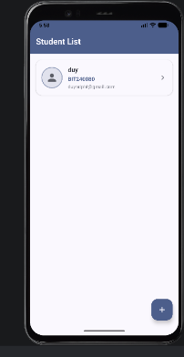
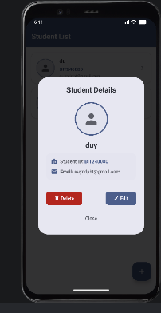
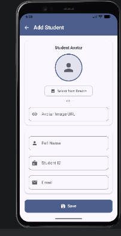

# 📱 Android Jetpack Compose - Quản lý Sinh Viên (Room Database CRUD)

[](https://developer.android.com/)
[](https://kotlinlang.org/)
[](https://developer.android.com/jetpack/compose)
[](https://m3.material.io/)
[](https://developer.android.com/training/data-storage/room)
[](https://developer.android.com/jetpack/compose/navigation)
[](https://coil-kt.github.io/coil/)

> Ứng dụng **Quản lý Sinh Viên** phát triển bằng **Jetpack Compose** và **Room Database**, hỗ trợ đầy đủ các thao tác **CRUD** (Thêm, Đọc, Sửa, Xóa), lưu trữ dữ liệu bền vững cục bộ (Local Persistence), cơ chế chọn ảnh từ thư viện thiết bị hoặc link trực tuyến, hộp thoại xác nhận trước thao tác nhạy cảm và tự động hỗ trợ đa ngôn ngữ (**Tiếng Việt / Tiếng Anh**).

---

## 📌 Mục lục
- [Giới thiệu dự án & Yêu cầu](#-giới-thiệu-dự-án--yêu-cầu)
- [Công cụ & Công nghệ sử dụng](#-công-cụ--công-nghệ-sử-dụng)
- [Quá trình thực hiện & Kiến trúc hệ thống](#-quá-trình-thực-hiện--kiến-trúc-hệ-thống)
- [Hình ảnh Demo giao diện](#-hình-ảnh-demo-giao-diện)
- [Video Demo chạy ứng dụng](#-video-demo-chạy-ứng-dụng)
- [Hướng dẫn cài đặt & Chạy ứng dụng](#-hướng-dẫn-cài-đặt--chạy-ứng-dụng)
- [Cấu trúc thư mục dự án](#-cấu-trúc-thư-mục-dự-án)
- [Thông tin sinh viên thực hiện](#-thông-tin-sinh-viên-thực-hiện)

---

## 📖 Giới thiệu dự án & Yêu cầu

Dự án được xây dựng bám sát 100% các tiêu chí yêu cầu trong bài thực hành Android:

1. **Thông tin đối tượng Sinh viên:**
   - **Họ và tên:** Tên đầy đủ của sinh viên (`name`).
   - **Mã số sinh viên (MSSV):** Định danh sinh viên (`studentId`), kiểm tra định dạng chuẩn (`BIT240080`).
   - **Email:** Địa chỉ email sinh viên (`email`), kiểm tra định dạng email hợp lệ.
   - **Ảnh Avatar:** Hỗ trợ linh hoạt cả **2 hình thức**: dán link trực tiếp (URL) hoặc chọn ảnh từ bộ nhớ thiết bị (`PickVisualMedia`).
2. **Lưu trữ CSDL cục bộ (Local Database):**
   - Tích hợp **Room Database** (SQLite abstraction) tối ưu cho Android, đảm bảo đồng bộ dữ liệu tức thì, không bị mất khi đóng app.
   - Thao tác bất đồng bộ thông qua **Kotlin Coroutines (`Dispatchers.IO`)** và **Flow / StateFlow**.
3. **Các màn hình & Hộp thoại chức năng:**
   - **Trang 1 (Danh sách sinh viên):** Hiển thị danh sách sinh viên dưới dạng các Card trực quan kèm ảnh đại diện tròn, họ tên, MSSV, email; nút bấm nổi `FloatingActionButton (+)` để thêm sinh viên mới.
   - **Trang 2 (Hộp thoại chi tiết sinh viên):** Khi bấm vào 1 sinh viên ở Trang 1, hiển thị hộp thoại (`AlertDialog`) xem chi tiết thông tin, kèm nút chức năng **Sửa** và **Xóa**.
   - **Trang 3 (Thêm / Sửa sinh viên):** Form nhập liệu hiện đại cho phép thêm mới hoặc chỉnh sửa dữ liệu sinh viên hiện có, tích hợp Photo Picker và kiểm tra tính hợp lệ dữ liệu đầu vào.
4. **Hộp thoại xác nhận (Confirmation Dialog):**
   - Trước khi thực hiện chức năng **Sửa** hoặc **Xóa**, ứng dụng luôn bật hộp thoại xác nhận:
     > *"Bạn có muốn sửa / xóa thông tin SV không?"*
   - Chỉ khi người dùng bấm nút **"Có"** thì hệ thống mới tiến hành cập nhật hoặc xóa khỏi CSDL.
5. **Hỗ trợ Đa ngôn ngữ (Localization):**
   - Tự động thay đổi ngôn ngữ giao diện theo cài đặt ngôn ngữ của thiết bị:
     - **Tiếng Việt (`res/values-vi`)**
     - **Tiếng Anh (`res/values`)**

---

## 🛠 Công cụ & Công nghệ sử dụng

| Phân loại | Công nghệ / Thư viện | Mô tả chi tiết |
| :--- | :--- | :--- |
| **Ngôn ngữ** | **Kotlin 2.x** | Hiện đại, ngắn gọn, null-safety và tối ưu hóa luồng coroutines. |
| **Giao diện (UI)** | **Jetpack Compose** | Bộ công cụ khai báo UI thế hệ mới (Declarative UI) từ Google. |
| **Thiết kế** | **Material Design 3 (M3)** | Chuẩn giao diện hiện đại với `Scaffold`, `TopAppBar`, `ElevatedCard`, `AlertDialog`. |
| **Cơ sở dữ liệu** | **Room Database 2.6.1** | ORM chuẩn cho SQLite, hỗ trợ Annotation Processor và bảo đảm an toàn kiểu dữ liệu. |
| **Bất đồng bộ** | **Kotlin Coroutines & Flow** | Xử lý truy vấn dữ liệu ngầm mượt mà, cập nhật StateFlow theo thời gian thực. |
| **Kiến trúc** | **MVVM (Model - View - ViewModel)** | Tách biệt hoàn toàn tầng dữ liệu, logic xử lý và giao diện người dùng. |
| **Tải ảnh** | **Coil 2.7.0 (`coil-compose`)** | Thư viện tải và cache ảnh bất đồng bộ hiệu năng cao. |
| **Điều hướng** | **Navigation Compose 2.7.7** | Quản lý chuyển trang và truyền tham số an toàn giữa các màn hình. |
| **Hệ thống Build** | **Gradle (Kotlin DSL - `.kts`)** | Quản lý phụ thuộc tập trung qua Version Catalog (`libs.versions.toml`). |

---

## 🚀 Quá trình thực hiện & Kiến trúc hệ thống

```
┌────────────────────────────────────────────────────────┐
│                   UI Layer (Compose)                   │
│  [StudentListScreen]   [StudentDetailDialog]  [AddEdit] │
└───────────────────────────▲────────────────────────────┘
                            │ (StateFlow / Actions)
┌───────────────────────────┴────────────────────────────┐
│                    StudentViewModel                    │
│           (Quản lý trạng thái, Coroutines IO)          │
└───────────────────────────▲────────────────────────────┘
                            │ (CRUD Queries / Flow)
┌───────────────────────────┴────────────────────────────┐
│                  Room Database Layer                   │
│         [StudentDao] ───► [StudentDatabase (SQLite)]   │
└────────────────────────────────────────────────────────┘
```

1. **Tầng Thực thể & DAO (`data/`):**
   - `Student.kt`: Entity gồm `id` (AutoGenerate), `name`, `studentId`, `email`, `avatarUri`.
   - `StudentDao.kt`: Giao diện DAO khai báo các hàm truy vấn `getAllStudents()` dạng `Flow`, `insertStudent()`, `updateStudent()`, `deleteStudent()`.
   - `StudentDatabase.kt`: Lớp trừu tượng kế thừa `RoomDatabase` triển khai mẫu thiết kế **Singleton Pattern** để đảm bảo duy nhất một thể hiện kết nối CSDL.
2. **Tầng ViewModel (`ui/StudentViewModel.kt`):**
   - Sử dụng `AndroidViewModel` kết hợp `viewModelScope.launch(Dispatchers.IO)` để thực hiện các thao tác ghi dữ liệu ngầm an toàn mà không làm giật/lag giao diện (ANR).
   - Dữ liệu danh sách được phơi bày dưới dạng `StateFlow<List<Student>>`.
3. **Tầng Giao diện người dùng (`ui/screens/` & `ui/components/`):**
   - Tách biệt rõ ràng các thành phần giao diện tái sử dụng: `StudentDetailDialog` (popup chi tiết), `ConfirmDialog` (hộp thoại xác nhận an toàn).
   - Kiểm tra định dạng đầu vào (Validation): Không để trống trường nào, Email phải có ký tự `@` và domain, MSSV bắt buộc bắt đầu bằng chữ hoa `B`.

---

## 📸 Hình ảnh Demo giao diện

Dưới đây là hình ảnh thực tế chạy ứng dụng trên máy ảo Android (Pixel 4 - Android API 37.2):

| 1. Trang 1: Danh sách sinh viên | 2. Trang 2: Hộp thoại xem chi tiết SV | 3. Trang 3: Màn hình thêm sinh viên |
| :---: | :---: | :---: |
|  |  |  |
| **Trang 1 - Student List:**<br>Hiển thị danh sách sinh viên dạng thẻ (`ElevatedCard`) với Avatar tròn, Họ tên (`duy`), MSSV (`BIT240080`), Email và nút bấm nổi **FAB (+)** ở góc dưới để mở màn hình thêm sinh viên mới. | **Trang 2 - Student Details (Dialog):**<br>Hộp thoại popup hiển thị avatar lớn, thông tin chi tiết sinh viên, tích hợp các nút hành động trực tiếp: **Delete (Xóa - Đỏ)**, **Edit (Sửa - Xanh)** và nút **Close** để đóng. | **Trang 3 - Add Student:**<br>Form tiếp nhận thông tin sinh viên với tùy chọn ảnh đại diện (chọn từ thiết bị qua Photo Picker hoặc nhập link URL), các trường Họ tên, MSSV, Email và nút **Save** để lưu vào Room DB. |

---

## 🎥 Video Demo chạy ứng dụng

> [!NOTE]
> **Video demo chạy ứng dụng:** Sẽ được thêm vào trong thời gian sớm nhất.

---

## 💻 Hướng dẫn cài đặt & Chạy ứng dụng

### Yêu cầu môi trường
* **Android Studio** (phiên bản Iguana / Jellyfish / Koala / Ladybug hoặc mới hơn).
* **JDK 17** hoặc **JDK 21+** (có sẵn trong Android Studio JBR).
* Thiết bị Android thật (bật USB Debugging) hoặc Android Emulator.

### Các bước thực hiện:
1. **Clone mã nguồn từ GitHub:**
   ```bash
   git clone https://github.com/duynguyen1012/bai_tap_buoi_4.git
   ```

2. **Mở dự án trong Android Studio:**
   * Mở Android Studio ➔ Chọn **Open** ➔ Điều hướng tới thư mục `bai_tap_buoi_4`.

3. **Đồng bộ mã nguồn (Sync Gradle):**
   * Nhấn nút **Sync Project with Gradle Files** và đợi tải xong các thư viện.

4. **Chạy ứng dụng:**
   * Chọn máy ảo hoặc điện thoại Android đã cắm cáp.
   * Nhấn **Run ▶** (hoặc phím tắt `Shift + F10`).

---

## 📂 Cấu trúc thư mục dự án

```text
bai_tap_buoi_4/
├── app/
│   ├── src/
│   │   ├── main/
│   │   │   ├── java/com/example/baitapbuoi4/
│   │   │   │   ├── MainActivity.kt                 # Điều hướng chính NavHost và khởi tạo App
│   │   │   │   ├── data/
│   │   │   │   │   ├── Student.kt                  # Room Entity
│   │   │   │   │   ├── StudentDao.kt               # Room Data Access Object
│   │   │   │   │   └── StudentDatabase.kt          # Room Database Singleton
│   │   │   │   └── ui/
│   │   │   │       ├── StudentViewModel.kt         # Quản lý StateFlow và thao tác CRUD
│   │   │   │       ├── screens/
│   │   │   │       │   ├── StudentListScreen.kt    # Trang 1: Danh sách sinh viên
│   │   │   │       │   └── AddEditStudentScreen.kt # Trang 3: Thêm / Sửa sinh viên
│   │   │   │       ├── components/
│   │   │   │       │   ├── StudentDetailDialog.kt  # Trang 2: Popup chi tiết sinh viên
│   │   │   │       │   └── ConfirmDialog.kt        # Hộp thoại xác nhận Sửa / Xóa
│   │   │   │       └── theme/                      # Cấu hình màu sắc, Theme M3
│   │   │   ├── res/
│   │   │   │   ├── values/strings.xml              # Bản dịch Tiếng Anh
│   │   │   │   └── values-vi/strings.xml           # Bản dịch Tiếng Việt
│   │   │   └── AndroidManifest.xml
│   └── build.gradle.kts                            # Cấu hình Module App & Dependencies
├── docs/
│   └── screenshots/                                # Ảnh chụp giao diện demo ứng dụng thực tế
│       ├── student_list_demo.png                   # Demo Trang 1: Danh sách sinh viên
│       ├── student_details_dialog_demo.png         # Demo Trang 2: Hộp thoại chi tiết SV
│       └── add_student_demo.png                    # Demo Trang 3: Màn hình thêm sinh viên
├── gradle/
│   └── libs.versions.toml                          # Version Catalog
├── build.gradle.kts
├── settings.gradle.kts
└── README.md                                       # Tài liệu dự án
```

---

## 👤 Thông tin sinh viên thực hiện

* **Họ và tên:** Nguyễn Đức Duy
* **Mã số sinh viên (MSSV):** BIT240080
* **GitHub Repository:** [https://github.com/duynguyen1012/bai_tap_buoi_4](https://github.com/duynguyen1012/bai_tap_buoi_4)
* **Dự án:** Bài tập buổi 4 - Quản lý sinh viên với Jetpack Compose & Room Database
